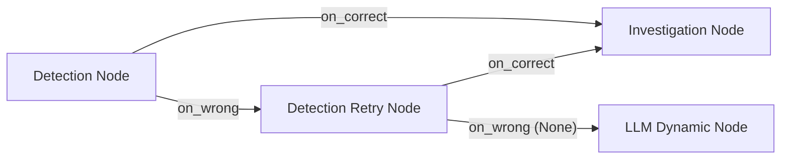

# Crisulator

### Built by Team Syn5ergy.exe

Crisulator is an immersive crisis-response simulation platform that helps students and early-career professionals gain hands-on experience handling real-world incidents before they encounter them in industry.

Contrast to the theoretica knowledge, users are placed directly into realistic crisis scenarios where every decision has consequences.

Users can take on one of three professional roles:

* Software Engineer (SWE)
* Cybersecurity Analyst
* Communications / Public Relations Manager

Each role experiences unique workflows, tools, stakeholders, and success criteria.


#Website: 
https://syn5ergy-exe-crisulator.vercel.app/

#Backend API:
https://syn5ergy-exe-api.onrender.com

---
#Demo Video: 

https://drive.google.com/file/d/1x0Uo0oxuwsMpAWkbZJT68HE_8TnQ4eHM/view?usp=drive_link

---

# The Problem

Students often learn:

* Cloud Computing
* Cybersecurity
* Distributed Systems
* Incident Response
* Crisis Communication

However, very few get the opportunity to experience:

* Production outages
* Security breaches
* Executive pressure
* Public relations crises
* High-stakes decision making

The first exposure to these situations often happens in a real company with real consequences.

Crisulator bridges this gap through experiential learning.

---

# Key Features

## Software Engineering Simulations

Investigate and resolve production incidents using realistic operational tooling.

Examples:

* AWS S3 Outage
* Payments Retry Storm
* Database Failures
* Deployment Failures
* Infrastructure Outages

Available tools:

* Terminal
* Telemetry Dashboard
* GitHub PR Investigation
* SQL Workspace
* Deployment Center
* Incident Timeline

---

## Cybersecurity Simulations

Analyze and contain cyber attacks using a security-focused workflow.

Examples:

* Colonial Pipeline Ransomware
* Credential Theft
* Insider Threats
* Data Breaches
* Malware Incidents

Available tools:

* SIEM Dashboard
* Threat Sandbox
* Access Logs
* Network Investigation
* Containment Controls
* Threat Timeline

---

## Communications & PR Simulations

Manage public trust during organizational crises.

Examples:

* Boeing 737 MAX Crisis
* Data Breach Communications
* Product Recall Events
* Conference & Media Incidents

Available tools:

* Press Conference Feed
* Public Sentiment Dashboard
* Executive Stakeholder Panel
* Response Composer
* Media Monitoring

---

# How It Works

1. Select a role
2. Receive an incident briefing
3. Investigate available evidence
4. Form a hypothesis
5. Execute actions
6. Manage stakeholders
7. Resolve the incident
8. Receive a detailed postmortem

---

# Branching Decision System, AI Dynamics and Scoring System

# Architectural Specifications & DSA Backbone

## 1. Architectural Overview: The Hybrid Bounded Sandbox

Crisulator is built using a decoupled **Hybrid Bounded Sandbox** architecture. Rather than relying on a single, non-deterministic Large Language Model (LLM) to drive the game logic, the engine separates the **State & Scoring Engine** (deterministic) from the **Generative Feedback Layer** (probabilistic/AI).

```
 ┌─────────────────────────────────────────────────────────────────────────┐
 │                            FRONTEND (React)                             │
 └────────────────────────────────────┬────────────────────────────────────┘
                                      │
                                      ▼ [FastAPI REST Endpoints]
 ┌─────────────────────────────────────────────────────────────────────────┐
 │                        BACKEND ENGINE (FastAPI)                         │
 ├────────────────────────────────────┼────────────────────────────────────┤
 │  DETERMINISTIC STATE ENGINE        │  PROBABILISTIC GENERATIVE LAYER    │
 │  • Directed State Graph            │  • Dynamic Teammate Chat           │
 │  • Local Synonym Matcher           │  • Dynamic Challenge Generation    │
 │  • Category Allocation System      │  • Multi-Provider LLM Router       │
 └────────────────────────────────────┴────────────────────────────────────┘
```

### Key Architectural Benefits:
*   **Logical Soundness**: Game states, win/lose conditions, and scores are governed by mathematical rules, preventing AI hallucinations from breaking the gameplay.
*   **Offline Fallback Capability**: If cloud APIs are rate-limited or the network is offline, the game remains fully functional using local fallback logic.
*   **Micro-second Latency**: The fast-path local evaluator checks commands locally using semantic dictionaries, bypassing slow cloud I/O.

---

## 2. Core CS Fundamentals Implemented

### A. Finite State Automata (FSA)
The incident response walkthrough is modeled as a **Deterministic Finite Automaton**. 
*   **States ($S$)**: The phase nodes (Detection, Investigation, etc.) and their corresponding retry nodes.
*   **Inputs ($\Sigma$)**: The terminal commands executed by the user.
*   **Transition Function ($\delta$)**: Evaluated by the scoring engine to determine the next active state.
*   **Accepting States ($F$)**: The recovery phase node, triggering the session complete sequence.

### B. Circuit Breakers & Auto-Recovery Patterns ( LLM API failure )
The [llm_router.py] implements the **Circuit Breaker** design pattern to manage API failures. 
*   If a cloud provider fails 3 times consecutively, the connection is "tripped" (quarantined).
*   A 30-second cooldown is enforced, during which traffic is routed to secondary backups.
*   After the cooldown, the route is placed in a half-open state to check if operations have recovered.

### C. Concurrency & Non-Blocking Event Loops
FastAPI uses an asynchronous event loop (`asyncio`). To prevent slow, blocking network I/O from choking the single-threaded loop, the system executes synchronous requests in a concurrent thread pool using `loop.run_in_executor`.

---

## 3. Data Structures (The Backbone)

### A. Directed Graphs (Adjacency Mappings)
The simulation map is built as a **Directed Graph with Cycles**. 
*   **File**: [question_graph.py]
*   **Implementation**: Nodes are represented by `QuestionNode` dataclasses. The adjacency list is modeled using transition pointers: `on_correct`, `on_wrong`, and `on_critical`.



### B. Queues & Sliding Windows
To manage rate limiting on API keys, the system tracks token consumption using a sliding-window queue pattern.
*   **File**: [llm_router.py]
*   **Implementation**: Tracks time delta (`time.time() - window_start >= 60`) and resets the calls/tokens counts dynamically. In a scaled deployment, this is backed by a Redis sliding-window queue using sorted sets (`ZREMRANGEBYSCORE`).

### C. Hash Maps / Inverted Indexes (Synonym Dictionary)
The command parser performs high-speed synonym matches without using LLMs.
*   **File**: [evaluator.py]
*   **Implementation**: Implements `VERB_SYNONYMS` as a Hash Map (`Dict[str, set[str]]`). This maps target operations (e.g. `terminate`) to their equivalents (`kill`, `stop`, `revoke`), allowing $O(1)$ lookup complexity for action verification.

### D. Deterministic PRNG Seed Hashing
To prevent question repetition across users without saving massive state mappings in memory, the system uses seed hashing.
*   **File**: [question_variants.py]
*   **Implementation**: A cryptographic hash function (MD5) generates a seed from session values
    This seed initializes a Pseudo-Random Number Generator (`random.Random(seed)`), selecting a prompt variant. This ensures $O(1)$ memory complexity and guarantees that a player sees the same questions on replay, but different players see unique variations.

---

## 4. Algorithmic Implementations

### A. Fuzzy Semantic Token Matching Algorithm
The command parser cleans and matches inputs using set operations to filter command syntax:

```python
def _clean_tokens(text: str) -> set[str]:
    # 1. Strip flags and parameters using regex: -+[a-zA-Z0-9_-]+
    cleaned = re.sub(r'-+[a-zA-Z0-9_-]+', '', text)
    # 2. Tokenize and remove stop words (e.g., 'the', 'sudo')
    tokens = {w for w in cleaned.lower().split() if len(w) > 2}
    return tokens - STOP_WORDS
```

After cleaning, the system checks for intersection overlap between user tokens ($U$) and expected tokens ($E$):
$$\text{Overlap} = \frac{|U \cap E|}{|E|}$$
If the overlap ratio is $\ge 0.5$, or if a verb synonym is matched alongside at least one target noun, the system confirms a semantic match in $O(N + M)$ time.

### B. Proportional Integer Distribution Algorithm (Score Splitting)
When a command triggers a score impact (e.g., `+10` points), the system must distribute this integer across the 6 scoring categories. Because floats cannot represent currency or exact points cleanly without rounding errors, the system implements a proportional integer distribution algorithm:

1.  **Weight Mapping**: Determines weights based on command verbs (e.g., communication commands weight the communication category at 60%).
2.  **Raw Distribution**: Multiplies score impact by normalized weights: $\text{Raw}_i = \text{ScoreImpact} \times \text{Weight}_i$.
3.  **Rounding and Clipping**: Rounds floats to nearest integers and clips them between negative and positive category caps.
4.  **Difference Resolution**: Calculates the difference between the sum of the rounded categories and the target score impact:
    $$\text{Diff} = \text{ScoreImpact} - \sum \text{Clipped}_i$$
5.  **Proportional Allocation**: Walks through the categories (sorted by weight descending) and adds/subtracts $1$ point step-by-step until the difference is resolved, mathematically guaranteeing that category scores always sum exactly to the final score impact.


# Technology Stack

### Frontend

* React.js
* Vite
* Tailwind CSS
* React Router

### Backend

* FastAPI
* Python

### Simulation Engine

* Custom Branching Incident Engine
* Scenario Orchestrator
* Consequence Engine
* State Management System

### Scenario Framework

* YAML Scenario Sources
* Archetypes
* Flavorpacks
* Scenario Compiler

### AI Layer

* LLM-Powered Stakeholder Interactions
* AI Postmortem Generation
* Dynamic Scenario Content

### Data Storage

* JSON Scenario Definitions

---

# Project Structure

```text
frontend/
│
├── src/
├── components/
├── pages/

backend/
│
├── engine/
├── scenarios/
├── archetypes/
├── flavorpacks/
├── tools/

docs/
```

---

# Running Locally

## Backend

```bash
cd backend

pip install -r requirements.txt

uvicorn main:app --reload
```

Backend:

```text
http://localhost:8000
```

---

## Frontend

```bash
cd frontend

npm install

npm run dev
```

Frontend:

```text
http://localhost:5173
```

---

# Future Vision

Crisulator aims to become a career-readiness platform that helps students develop operational decision-making skills through realistic simulations.

Planned future integrations include:

* LinkedIn Achievement Sharing
* Skill Transcript Generation
* Recruiter Evaluation Dashboard
* Replay Viewer
* Multiplayer Incident Rooms
* Enterprise Training Mode

---

# Team

**Team Name:** Syn5ergy.exe

Built for experiential learning, professional readiness, and crisis management education.

---

# Mission

**Learn by responding, not by watching.**

Crisulator transforms theoretical knowledge into practical crisis-management experience.
